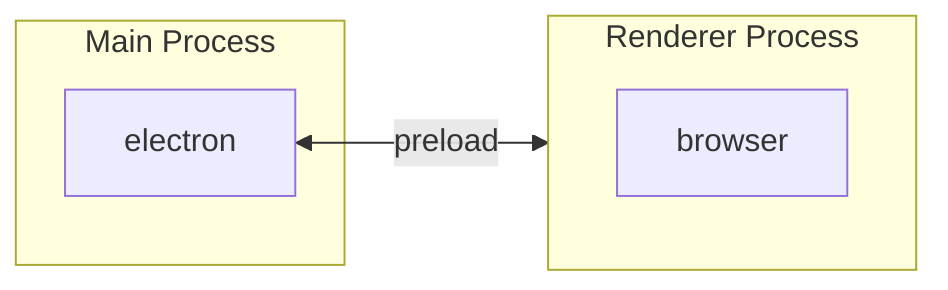

# SveltronKit

A minimal template for building Electron apps with SvelteKit.

Includes native support for Typscript and uses Electron's official recommended Electron Forge for packaging.

Everything you can do in SvelteKit, you can do in SveltronKit; meaning that you can use component
libraries like [Shadcn-Svelte](https://next.shadcn-svelte.com/).

> [!IMPORTANT]
> This template uses SvelteKit's [hash router](https://svelte.dev/docs/kit/configuration#router) to
> create a single-page app. The only difference you'll have to look out for is to start all your routed
> links with `#/` instead of `/`.

## Dependencies & Frameworks

- [SvelteKit](https://kit.svelte.dev/)
- [Electron](https://www.electronjs.org/)
- [Electron Forge](https://www.electronforge.io/)
- [TypeScript](https://www.typescriptlang.org/)
- [TailwindCSS](https://tailwindcss.com/)

> [!NOTE]
> I've included TailwindCSS in this template because I use it in my own projects, but you can remove
> it easily if you don't want it.

## Getting Started

> [!WARNING]
> This project uses [`pnpm`](https://pnpm.io/) and uses [patching](https://pnpm.io/cli/patch) to work
> around some issues with SvelteKit. When this [PR](https://github.com/sveltejs/kit/pull/13812) merges,
> you can remove the patching and use the latest version of SvelteKit.

Start by installing the dependencies:

```
pnpm install
```

**Development:**

```
pnpm run start
```

[Electron Forge](https://www.electronforge.io/) with the [Vite plugin](https://www.electronforge.io/plugins/vite)
will take care of running the development server and building the app for you. You don't need to run
`vite dev` or `vite build` yourself. This also means that it supports hot module replacement (HMR).

**Production:**

```
pnpm run package
```

This will build the app and you can find the output in the `out` directory. You can run the production
app by opening the `.app` file in the `out` directory. This will not create your app's installer
for distribution though.

To create a distributable installer, you can use:

```
pnpm run make
```

This will create a distributable installer for your app. You can configure this in the `makers` section
in `forge.config.ts`. Reference the [makers documentation](https://www.electronforge.io/makers) for more
information.

# Electron Crash Course

> [!NOTE]
> This is a super simplified version of the Electron documentation meant to give you a general idea
> of how Electron works and how each file corresponds to responsibilities in Electron. For a more
> accurate description of how Electron works, you can refer to the [official documentation](https://www.electronjs.org/docs).

I found that most of the problems I encountered when setting up Electron were because I didn't know
how Electron works and that the documentation was too dense to get up to speed with, so I'll include
a crash course here. _I will be making a lot of analogies to web development_ as it seems like a lot
of people who are new to Electron come from web development.

Because everything in Electron is client based, you'll need to host your own server if you want to
access any sensitive logic like a database or authentication, etc.

## main.ts

This file defines what the main process will do. The process runs your app. It's the one that
creates and manages windows and also has permissions to access the file system. You also define
"_signals_"/"_endpoints_", through IPC, that let the renderer process (browser that runs your app)
can "_call_" to interact with the file system.

By default, Electron will block off file system access to the renderer process as a security measure,
which is the reason why you need to use IPC to interact with the file system.

## preload.ts

Think about this as a "bridge" or a "network"/"proxy" between the main process and the renderer process.
You specify what functions that the renderer process can call and these functions will usually be
interacting with the file system through the main process.

## renderer

The renderer process is the browser that runs your app. Just treat this like another SvelteKit app.

## Overview


